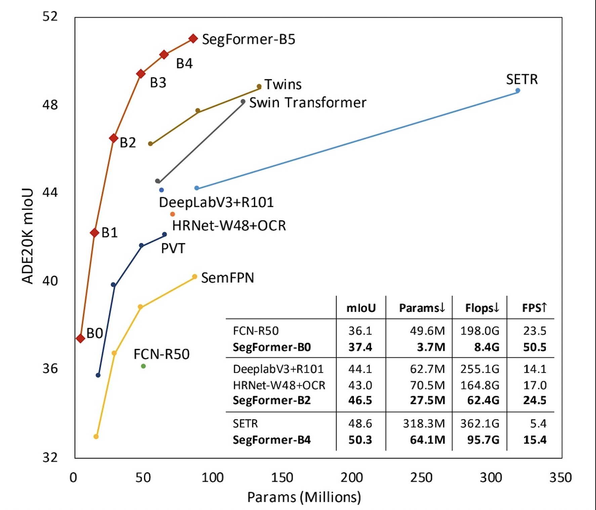
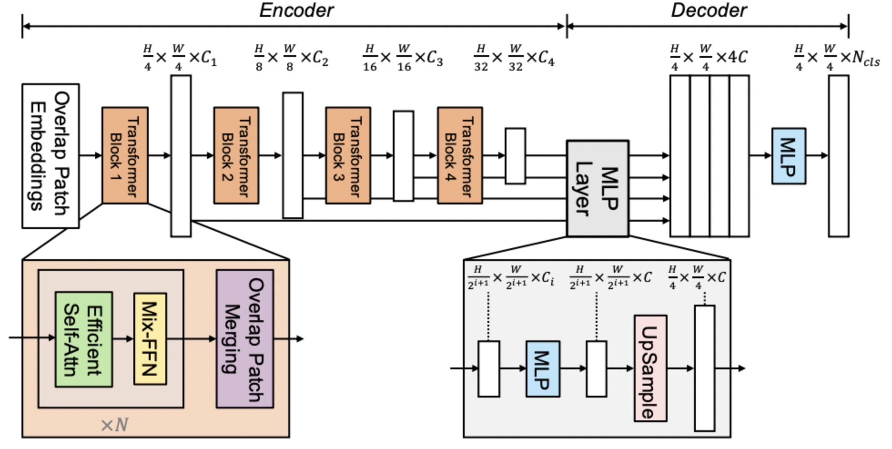
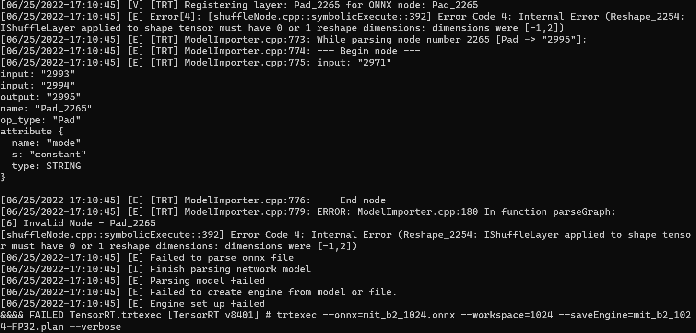
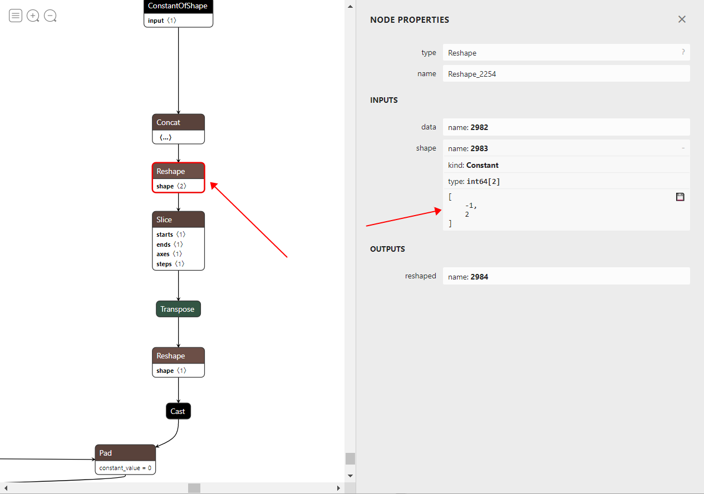
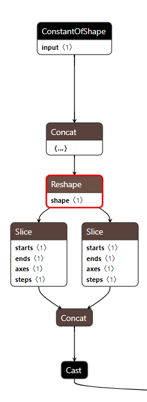
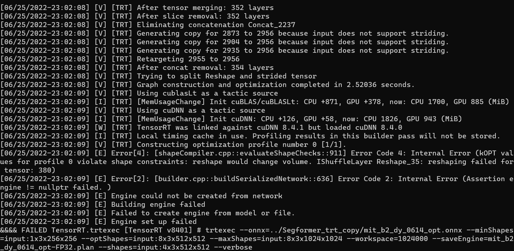
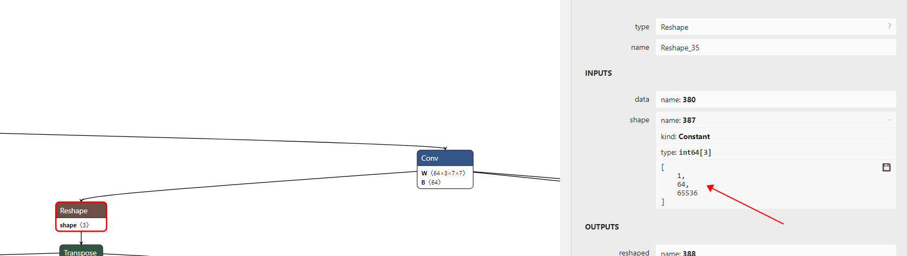
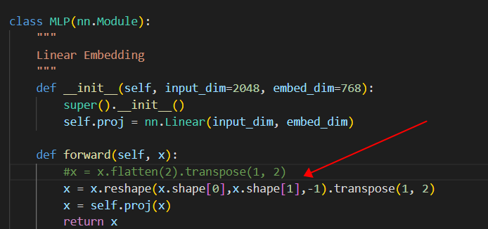
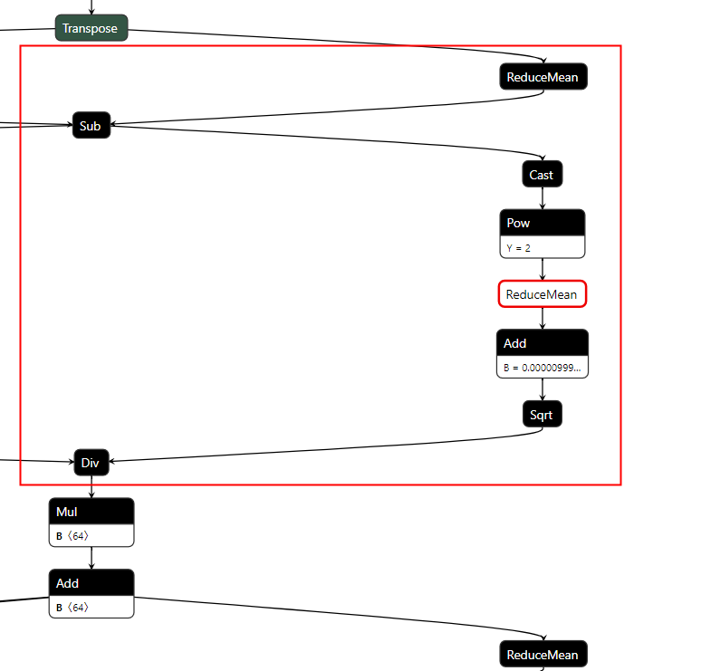

### 总述

- SegFormer ：https://github.com/NVlabs/SegFormers

- 优化效果：以输入1 x 3 x 1024 x1024为例，在onnx转换为trt速度为75.4649ms/张，进行LayerNorm算子合并后速度达到69.5628ms/张。

  前后处理获取掩码图效果不变，且与onnx输出掩码图（掩码图输出的均为大于0的整数）最大绝对值误差为17，绝对值误差中位数为0，平均绝对值误差为6.735e-02

- Docker步骤：

  ```
  #segformer_pytorch
  docker pull deanhh222/segformer:latest
  
  #segformer_trt
  docker pull deanhh222/segformer_trt:latest
  
  ```

  


### 原始模型

#### 模型简介

- 用途及效果：
  
  ​    (1)  一种简单、有效且鲁棒性强的语义分割的方法。SegFormer 由两部分组成：(1) 层次化Transformer Encoder (2) 仅由几个FC构成的decoder。SegFormer不仅在经典语义分割数据集(如：ADE20K, Cityscapes, Coco Stuff)上取得了SOTA的精度同时速度也不错(见图1)，而且在Cityscapes-C(对测试图像加各种噪声)上大幅度超过之前的方法，反映出其良好的鲁棒性。
  
  
  
  
  
- 业界实际运用：

     （1）在ncnn/tengine上进行部署，可以在移动端使用Transformer做语义分割，例如自动驾驶和机器人导航。

  

- 模型的整体结构：

     （1） SegFormer 的结构如图 2 所示，主要有两个模块：

  - hierarchical Transformer encoder：为了产生不同分辨率的特征

  - lightweight ALL-MLP decoder：聚合多层特征来产生最终的语义分割 mask

    

   


​       (2)   SegFormer 主要创新点是:

- encoder 是多层级的结构，能够同时捕捉不同分辨率的特征
- 没有使用位置编码
- 轻量级全MLP解码器设计，无需复杂且计算要求高的模块即可产生强大的表示

#### 模型优化难点

（1）静态onnx转trt模型时，图片分辨率为1024x1024时，会出现节点维度不匹配问题，无法成功转换为trt模型；

（2）动态onnx模型转trt时，同样出现节点维度不匹配问题；

（3）动态onnx模型转trt时，部分节点无法实现动态转换。

#### 优化过程

**Segformer包含b0～b5一系列模型，本优化过程均基于b2模型**。

- ##### 静态trt优化

```
#直接生成静态trt模型
bash ./Segformer_trt/build_st.sh
```

（1）pytorch转静态onnx模型，多尺度onnx模型生成（输入维度分别为1x3x256x256、1x3x512x512、1x3x1024x1024）；

```
python tools/pytorch2onnx.py local_configs/segformer/B2/segformer.b2.1024x1024.city.160k.py --checkpoint /app/weights/mit_b2.pth --output-file /app/weights/mit_b2_1024.onnx
```

（2）使用以下命令行将静态onnx转trt模型，1x3x256x256、1x3x512x512成功转换，1x3x1024x1024出现Reshape节点维度不匹配错误；

```
trtexec --onnx=mit_b2.onnx   --workspace=1024 --saveEngine=mit_b0-FP32.plan --verbose
```



（3）根据报错提示显示，该Reshape节点不支持reshape为二维Tensor，根据Reshape前后节点的输出及输入，合并及修改此节点，匹配输入维度，如下图所示为修改前节点



因Reshape_2254节点只支持reshape一维Tensor，所以将Reshape+slice+Transpose+Reshape操作合并为如下图所示操作，reshape-		>两个slice->concat两个slice输出。



         

（4）通过（3）中操作再执行trt模型转换指令，及可成功转出trt模型。

- 动态trt优化

```
#直接生成trt动态模型
bash ./Segformer_trt/build.sh
```

（1）onnx转trt指令如下：

```
trtexec --onnx=mit_b2.onnx  --minShapes=input:1x3x256x256 --optShapes=input:8x3x512x512  --maxShapes=input:8x3x1024x1024   --workspace=1024000 --saveEngine=mit_b2_dynamic_opt-FP32.plan --shapes=input:4x3x512x512  --verbose
```

（2）遇到与静态trt转换过程中同样的问题，以静态trt优化（3）为例解决bug。

（3）执行转换后的onnx，会出现以下错误，查看onnx该节点发现，输入为动态尺寸，经过卷积操作后输出大小为batchsize x 64 x H/4 x w/4，但是reshape节点类型固定。





（4）根据错误节点，找到pytorch源代码操作发现reshape操作使用flatten，使用reshape进行转换，分别将./mmseg/models/decode_heads/segformer_head.py 中MLP模型及  ./mmseg/models/backbones/mix_transformer.py  OverlapPatchEmbed、DWConv模型中前向推理过程修改，修改如下图所示：



修改后再将pytorch转onnx，然后经过onnx优化，执行（1）中指令，可成功转换trt动态模型。

（5）onnx模型中大量出现以下左图结构LayerNorm操作，且tensorrt没有统一的算子去对该结构做加速，首先合并onnx中的节点定义为LayerNorm如下右图所示， 自定义tensorrt  LayerNorm算子。根据pytorch原模型LayerNorm操作输入embedding，分别为64, 128, 256, 512，所以LayerNorm核函数实现动态线程输入，生成LayerNorm.so文件。

                                          

（6）经过以上修改，运行以下指令成功转换trt模型，--plugins为自定义plugin 生成so文件路径。

```
trtexec --onnx=mit_b2_opt.onnx  --minShapes=input:1x3x256x256 --optShapes=input:8x3x512x512  --maxShapes=input:8x3x1024x1024   --workspace=1024000 --saveEngine=mit_b2_dy_opt-FP32.plan --shapes=input:4x3x512x512 --plugins=./LayerNorm.so --verbose
```

#### 精度与加速效果

以输入1 x 3 x 1024 x1024为例，在onnx转换为trt速度为75.4649ms/张，进行LayerNorm算子合并后速度达到69.5628ms/张。

前后处理获取掩码图效果不变，且与onnx输出掩码图（掩码图输出的均为大于0的整数）最大绝对值误差为17，绝对值误差中位数为0，平均绝对值误差为6.735e-02

```
#生成onnx输出结果保存
python3 ./SegFormer_pytorch/tools/testSegFormer_onnx.py

#测试最终优化的trt模型
python3 ./Segformer_trt/testSegFormer.py

```

